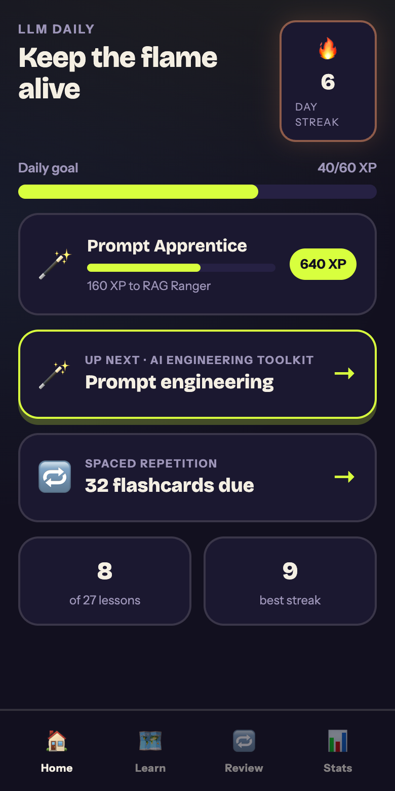
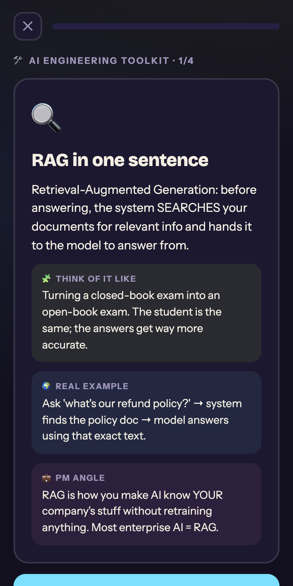
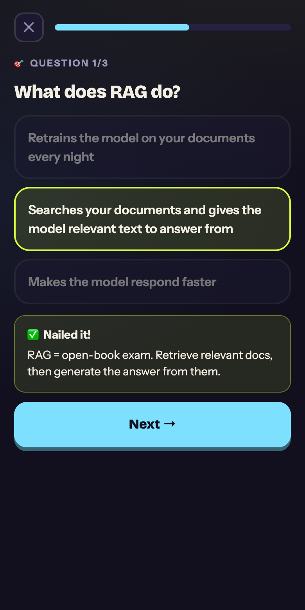
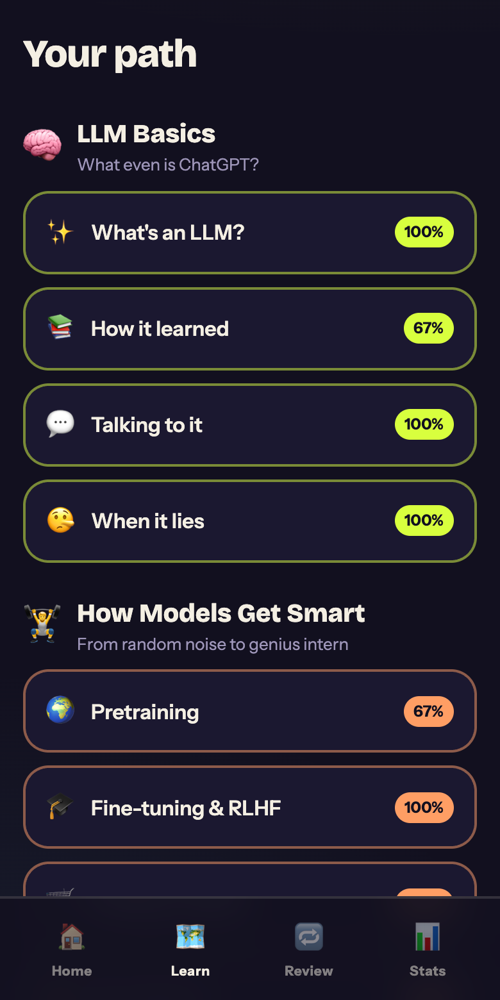
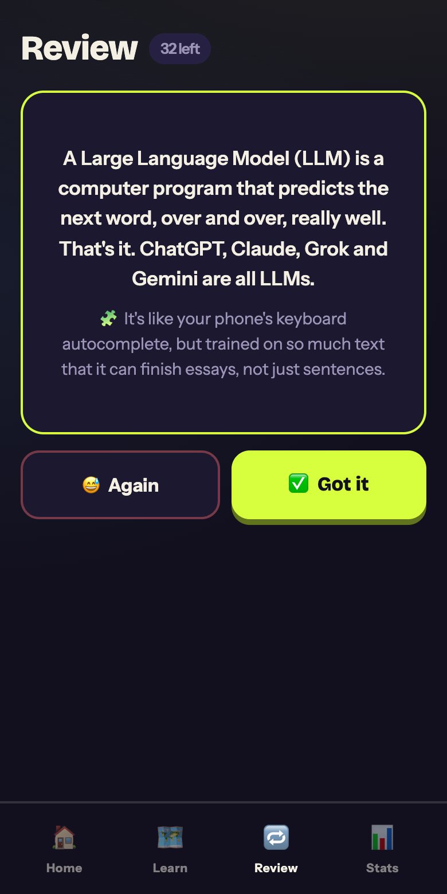
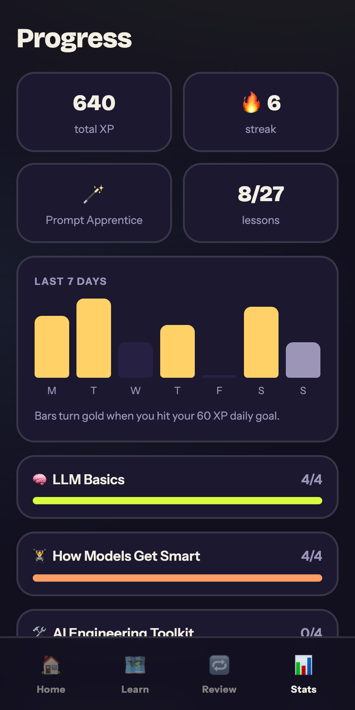

# ⚡ LLM Daily

**Duolingo for AI fluency.** A gamified study app that teaches LLMs, AI
engineering, and agentic AI in plain English — bite-size daily lessons made
for product managers (and anyone else) who wants to genuinely understand how
modern AI works.

**[▶ Try the live demo](https://claireknorth.github.io/llm-daily/)** — works
best on a phone, or shrink your browser window.

## The tour

| Home | Lesson | Quiz |
| --- | --- | --- |
|  |  |  |

| Learn path | Flashcard review | Progress |
| --- | --- | --- |
|  |  |  |

## How it works

Every concept card has the same four-part recipe, designed for people who
don't have an engineering background:

1. **The hook** — a plain-English definition in 1–2 sentences
2. **🧩 Think of it like…** — an analogy that makes it stick
3. **🌍 Real example** — a concrete, real-world case
4. **💼 PM angle** — why it matters when you're building product

Then the game loop keeps you coming back:

- **🔥 Streaks & daily goal** — 60 XP a day keeps the flame alive
- **🎯 Quizzes** — 3 questions after every lesson, with explanations for
  every answer (right or wrong)
- **🔁 Spaced repetition** — cards from completed lessons become flashcards
  scheduled with Leitner boxes: know it and it comes back later; miss it and
  it returns tomorrow
- **🏆 8 levels** — climb from 🐣 Curious Human to 🏆 AI PM Legend
- **📊 Progress tracking** — weekly activity chart and per-unit completion

## The curriculum

**6 units · 27 lessons · 108 concept cards · 81 quiz questions**

1. 🧠 **LLM Basics** — what an LLM actually is, tokens, training vs. inference, context windows, hallucinations
2. 🏋️ **How Models Get Smart** — pretraining, RLHF, alignment, picking the right model, multimodal & reasoning models
3. 🛠️ **AI Engineering Toolkit** — prompt engineering, RAG, evals, cost/latency/quality trade-offs
4. 🤖 **Agents & Agentic AI** — the agent loop, tool use, MCP, guardrails & trust
5. 🚀 **Building AI Products** — anatomy of an AI product, building a bot for real, AI metrics, safety
6. 🏆 **The AI PM Playbook** — talking like an AI PM, the industry landscape, product sense, ML fundamentals (NN vs. LLM, classic ML, rules-vs-ML-vs-LLM), model selection criteria, prompt evaluation, RAG internals, RLHF vs. DPO, and staying current

## Run it locally

```bash
npm install
npm run dev
```

Open the URL Vite prints (usually http://localhost:5173).

## Install it on your phone

LLM Daily is a PWA — it installs like a native app (full screen, home-screen
icon, works offline) with no app store involved:

1. Open the app URL in Safari (iPhone) or Chrome (Android)
2. Tap **Share** → **Add to Home Screen**

All progress is stored on your device — no account, no server, no tracking.

## Tech

- React 19 + TypeScript + Vite, zero runtime dependencies beyond React
- All state in `localStorage`; the whole app works offline via a service worker
- Curriculum is plain typed data (`src/content1.ts`, `src/content2.ts`) —
  adding a lesson is just adding an object
- `npm run shots` regenerates the README screenshots with Puppeteer
- `npm run demo` builds the live demo into `docs/` for GitHub Pages
